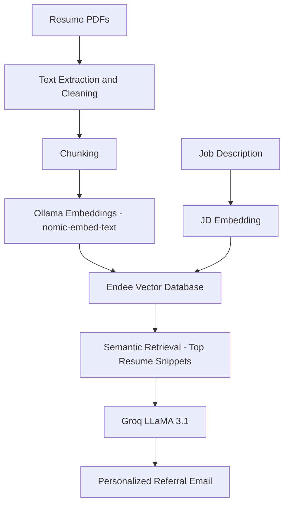

# RAG-Based Personalized Referral Email Generator using Endee

## Overview

This project implements a **Retrieval-Augmented Generation (RAG)** system that generates **personalized, fact-based referral request emails** using resume data.

Instead of generating generic emails, the system retrieves relevant experience from the candidate's resume using **semantic vector search** and uses that context to produce grounded and reliable outputs.

The project was developed as part of the **Endee Labs Project-Based Evaluation**.

---

## Problem Statement

Cold outreach and referral emails are often generic and not aligned with the candidate’s actual experience.  
LLM-based generators frequently produce **hallucinated or exaggerated content**.

---

## Solution

This system uses **vector search + RAG** to:

- Retrieve relevant resume snippets
- Ground the LLM in factual context
- Generate personalized referral emails

This ensures:

- No fabricated experience
- High relevance to job description
- Professional and human tone

---

## Key Features

- Multi-resume semantic search
- Grounded email generation
- Hallucination control using strict prompts
- Role-based retrieval (SDE / AI / Backend)
- Evidence-backed generation
- Local embeddings using Ollama
- Vector database powered by Endee
- Fast LLM inference via Groq

---
## Architecture Diagram



---

## Tech Stack

### Vector Database
- Endee

### Embeddings
- Ollama (`nomic-embed-text`)

### LLM
- Groq API (`llama-3.1-8b-instant`)

### Backend
- Python

### UI
- Streamlit

### Libraries
- PyPDF
- Requests
- Streamlit
- Groq SDK

---

## How It Works

1. Resume PDFs are parsed and cleaned.
2. Text is split into chunks.
3. Each chunk is converted into embeddings using Ollama.
4. Embeddings are stored in Endee vector index.
5. Job description is provided as input.
6. System retrieves relevant resume snippets.
7. Groq LLM generates a grounded referral email.

---


## Project Structure

```rag-referral-email-generator/
│
├── app/
│ ├── ingest_resume.py
│ ├── retrieve.py
│ ├── generate_email.py
│ ├── scrape_job.py
│ ├── main.py
│ ├── ui.py
│ └── profile.json
│
├── screenshots/
├── requirements.txt
└── README.mdx
```


---

## Setup Instructions

### 1. Clone Repository

### 2. Install Dependencies
`pip install -r requirements.txt`

### 3. Start Endee
`docker compose up -d`


### 4. Start Ollama
`ollama serve`
Ensure embedding model is available:
`ollama pull nomic-embed-text`


### 5. Ingest Resumes

`python app/ingest_resume.py`


### 6. Run UI

`streamlit run app/ui.py`


---

## Example Workflow

1. Paste Job Description
2. Select target role
3. System retrieves relevant resume evidence
4. Generates grounded referral email

---

## Results

- Generated emails remain factual
- No hallucinated internships or companies
- Relevant projects highlighted first
- Works reliably offline

---

## UI Screenshots

### Main Interface


### Retrieved Resume Evidence


### Generated Referral Email


## Future Improvements

- Skill gap analysis
- Resume optimization suggestions
- Auto role detection from JD
- Email export as PDF
- ATS score estimation

---

## Author

Rakshitha

---

## License

For academic and evaluation purposes.


